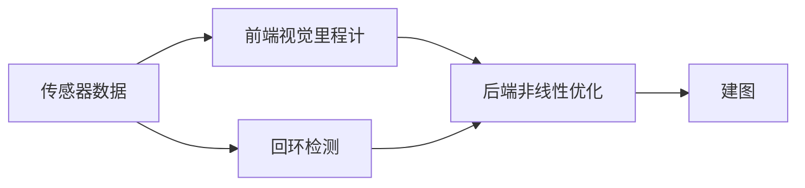

# 经典视觉SLAM框架

1、传感器信息读取：相机图像信息的读取和预处理。

2、**视觉里程计**（ Visual Odometry, VO ）：估算相邻图像间相机的运动和局部地图的样子。VO 又称为前端（ Front End ）。

* 可能的问题：**累积漂移**（ Accumulating Drift ），为了解决漂移，需要后端优化和回环检测。

3、**后端优化**（ Optimization ）：接受不同时刻视觉里程计的相机位姿和回环检测的信息，进行优化，得到全局一致的轨迹和地图，又称为后端（ Back End ）。

* 主要处理 SLAM 过程中**噪声**的问题

4、**回环检测**（ Loop Closing ）：判断机器人是否到达过先前的位置，如果检测到回环，将信息提供给后端处理。

5、**建图**（ Mapping ）：根据估计的轨迹建立地图。

* **度量地图**和**拓扑地图**